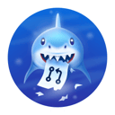
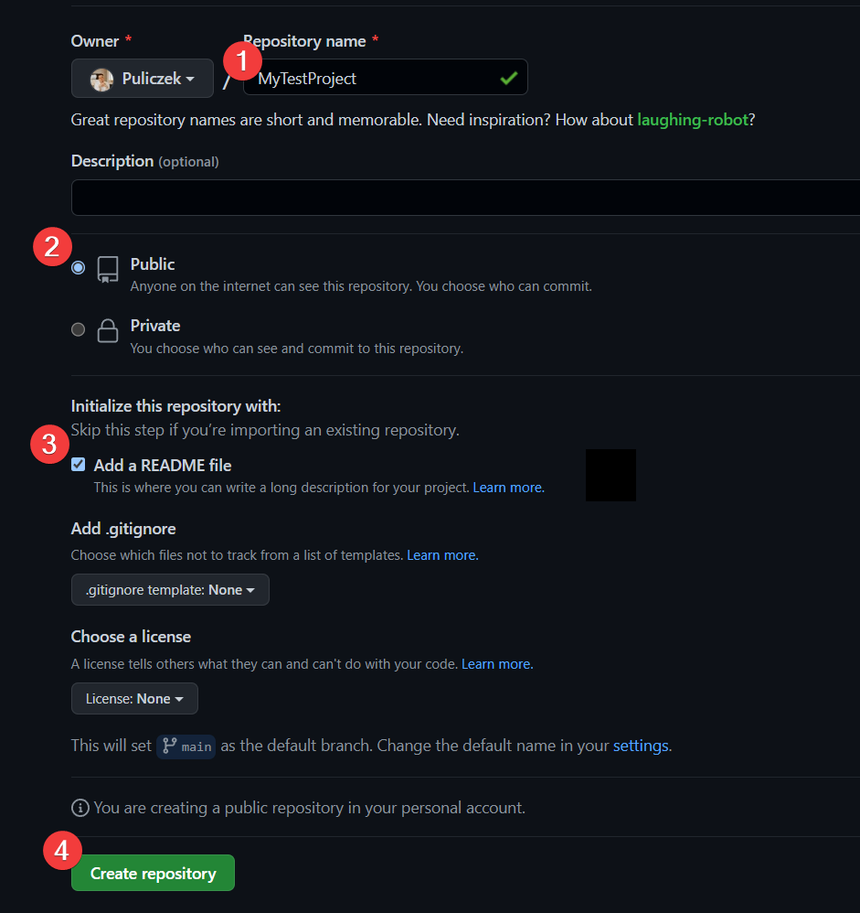
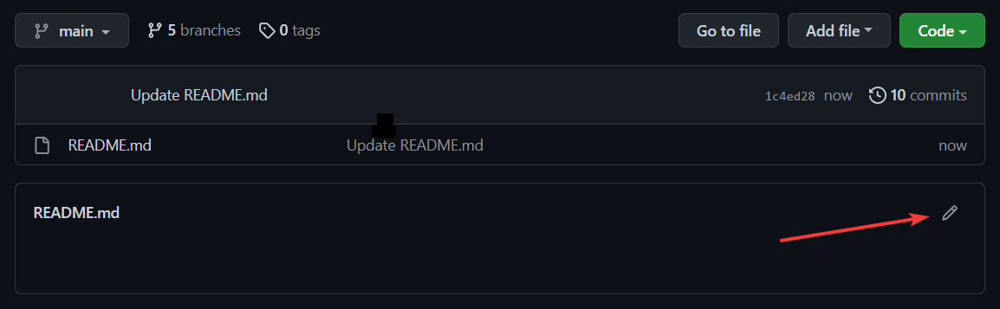
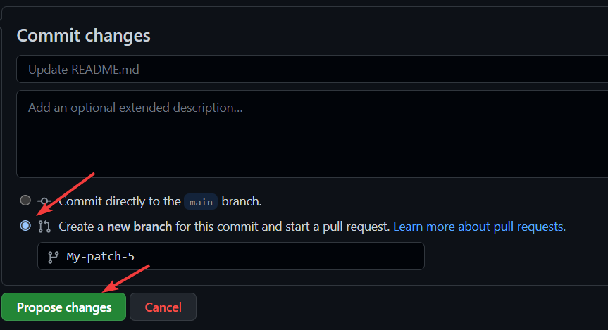
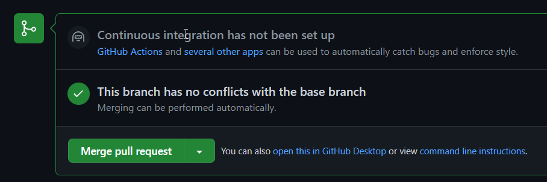

# Readme editado
## Readme editado por segunda vez
## Cómo desbloquear a Pull Shark?

🧠 Aprenderás a crear repositorios públicos, PR (Pull Request) y Merge PR (Pull Request)

### Paso a paso cómo conseguir el logro Pull Shark:

1. Cree un nuevo repositorio 

   PÚBLICO

    con README.md - https://github.com/new

   

   Imagen 1 - Ejemplo de creación de un nuevo repositorio público

2. Editar 

   README.md

   Imagen 2 - Editar archivo Léame

3. Guarde 

   README.md

    y cree una nueva rama

   Imagen 3: cómo guardar el archivo README y crear una nueva solicitud de extracción

4. Haga clic en **Crear solicitud de extracción**

5. Haga clic en 

   Fusionar solicitud de extracción

   Imagen 4 - solicitud de extracción de fusión

6. Repite los pasos 2 a 6 **(debes hacerlo 2 veces para obtener un logro)**

🎉 ¡Felicitaciones ! ¡Acabas de obtener el **logro Pull Shark!** 😎
